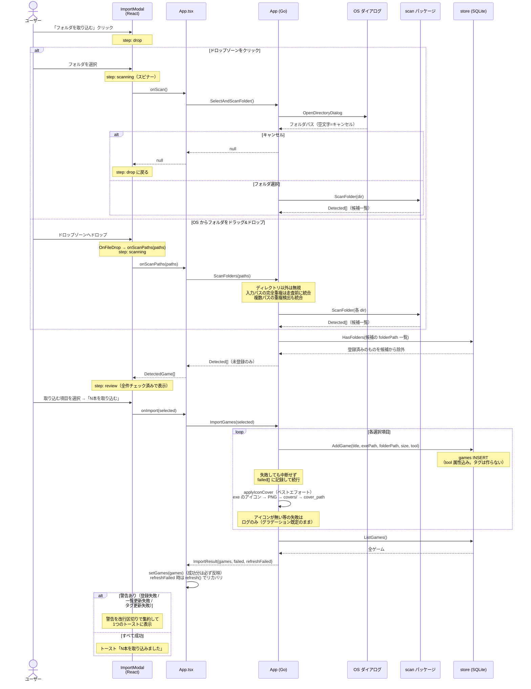
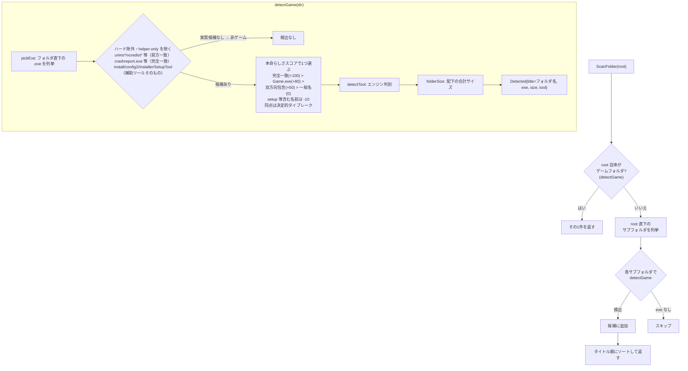

# フォルダ取り込みの処理フロー

「フォルダを取り込む」→ スキャン → レビュー → 登録 の内部処理。実装は
`frontend/src/components/ImportModal.tsx` / `app.go` / `internal/scan/scan.go` / `internal/store/store.go`。

## 全体シーケンス

## スキャンの内部ロジック（`scan.ScanFolder`）

### エンジン判別の根拠（`detectTool`）

フォルダ直下のファイル / ディレクトリ名で判定する（優先順に評価）:

| 判定 | 根拠となるファイル構成 | `tool` の値 |
|---|---|---|
| Unity | `<exe名>_Data/` ディレクトリ | `Unity` |
| WOLF RPG | `*.wolf`（例: `Data.wolf`） | `WOLF RPG` |
| Godot | `<exe名>.pck` | `Godot` |
| RPGツクール VX/XP系 | `*.rgss3a` / `*.rgss2a` / `*.rgssad` | `RPGツクール` |
| RPGツクール MV/MZ | NW.js 構成（`nw.dll` / `nw_elf.dll`）＋ `www/` ディレクトリ または `Game.exe` | `RPGツクール` |
| ティラノ | `tyrano/` または `tyrano_data/` ディレクトリ | `ティラノ` |
| 判別不能 | 上記どれにも該当しない | `未判別` |

- 判別したツール名は **`games.tool` 属性**として保存される（タグは作らない。調整版ハンドオフ 変更点3）。取り込み後にドロワーの `SetTool` で変更できる
- タイトルは**フォルダ名**をそのまま使う（取り込み後にドロワーで変更可能）
- exe の探索は**フォルダ直下のみ**（サブフォルダの exe は見ない）。サイズ集計は配下すべてを再帰的に合計

## エラー・エッジケースの扱い

| ケース | 挙動 |
|---|---|
| ダイアログをキャンセル | `null` が返り、モーダルは drop 画面に戻る |
| .exe が1つも見つからない | 空配列 → review 画面に「ゲームが見つかりませんでした」 |
| 全候補が登録済み | 同上（`HasFolders` で除外された結果 0 件） |
| 同じフォルダを重複してドロップ | 走査前に1つに畳む（`normFolderKey` で `filepath.Clean` ＋ 小文字化するので、末尾セパレータ違い・大文字小文字違いも同一とみなす）。走査時間の大半は `folderSize` なので二重走査を避け、進捗の分母も水増ししない |
| 親フォルダと子フォルダを同時にドロップ | **どちらも走査する**（畳まない）。走査は1階層しか見ないため、親の走査では子の配下にあるゲームに届かない。畳むと取りこぼす（[Issue #50](https://github.com/e-suzuno/d-game-manager/issues/50)）。同じフォルダが両方から検出された場合は結果側の重複排除で1件になる |
| スキャン中の読み取りエラー | エラーを reject → モーダルは drop 画面に戻る |
| 登録時の失敗（DB エラー等） | 失敗した項目だけ `failed[]` に記録して残りは続行。トーストに失敗件数とタイトルを表示（成功分は一覧に反映） |
| 登録後の一覧再取得に失敗 | `refreshFailed=true` → フロントが `refresh()` でリカバリ。それも失敗したときは `games`（この取り込みで登録できた分）を既存一覧へマージして表示し、「N本を取り込みました」+「一覧の更新に失敗しました」を警告 |
| 直下に複数ゲームの exe が混在する1フォルダ | **1件として検出**（exe は優先順位で1つだけ選択、サイズは合算）。1フォルダ=1ゲームが前提のため、フォルダを分けて取り込む |
| ゲームフォルダの中にゲームが入れ子 | 親の1件だけ検出（root がゲームと判定された時点で打ち切り）。子は**子フォルダを直接選択**すれば別ゲームとして登録可能 |
| ファイルをドロップ（フォルダでない） | `ScanFolders` が読み飛ばす。全部ファイルなら検出0件として review 画面へ |
| exe にアイコンリソースが無い | カバーは従来どおりグラデーション既定（ログに抽出スキップを記録） |

## ドラッグ&ドロップの実装メモ

- `main.go` の `DragAndDrop{EnableFileDrop: true}` で Wails のネイティブ D&D を有効化。ドロップを受け付けるのは CSS で `--wails-drop-target: drop` を宣言した要素（= ImportModal のドロップゾーン）だけ
- ドラッグ中は Wails が `wails-drop-target-active` クラスを付与するので、hover と同じハイライトを当てている
- コンポーネント純粋性の方針（Go / wailsjs 依存はトップレベル隔離）のため、`OnFileDrop` の購読は `App.tsx` から `subscribeFileDrop` として注入する。ImportModal は drop ステップの間だけ購読する（Storybook では模擬ボタンで発火）

### 購読できるのは1箇所だけ（2箇所目を足す前に読む）

Wails ランタイムの `OnFileDrop` / `OnFileDropOff` は**アプリ全体で1組しか持てない**。実装は `github.com/wailsapp/wails/v2@v2.13.0/internal/frontend/runtime/desktop/draganddrop.js`。

- `OnFileDrop` は `flags.registered` を見て、2回目以降の登録を**警告もエラーも出さずに無視する**。2箇所目のコールバックは置き換わるのでも累積するのでもなく、単に捨てられる
- `OnFileDropOff` は引数を取らず、`EventsOff("wails:file-drop")` でそのイベント名の全リスナを一括削除する。`dragover` / `dragleave` / `drop` の window リスナも外れるため `wails-drop-target-active` のハイライトも止まる。`flags.registered` も false に戻る

現在 `OnFileDrop` を購読しているのは ImportModal の1箇所だけなので**実害はない**（`App.tsx` の `subscribeFileDrop` が返す解除関数は素で `OnFileDropOff()` を呼ぶ）。ただし2箇所目が購読した瞬間に次の2つが同時に起きる。

- 2箇所目のコールバックは一度も呼ばれない（登録が無視されるため）
- どちらか一方がアンマウントすると、残った側のドロップ受付も死ぬ（全解除されるため）

どちらも例外もログも出ないので、症状から原因に辿り着くのが難しい。**2箇所目を足すときは `subscribeFileDrop` を購読箇所の集合で管理する形に変えること**（登録が0→1になったときだけ `OnFileDrop`、1→0になったときだけ `OnFileDropOff` を呼ぶ）。その際の注意点は2つ。

- `OnFileDropOff` で `flags.registered` が false に戻るため、**0→1 の再購読では必ず `OnFileDrop` を呼び直す**。忘れると2回目にモーダルを開いたときドロップが死ぬ
- `useDropTarget` は初回登録時の値が焼き付いて以降は無視される。購読ごとに違う値を渡せるように見せてはいけない（現状は全箇所 `true` 固定）

経緯は [Issue #51](https://github.com/e-suzuno/d-game-manager/issues/51)。**コードは未修正のまま**で、この記録が2箇所目を足す時点でのガードを兼ねている。

## 補足

- プロトタイプにあった「約1.4秒のスキャン演出」は実装していない。実際のスキャン時間（フォルダサイズ集計に依存）だけスピナーが表示される
